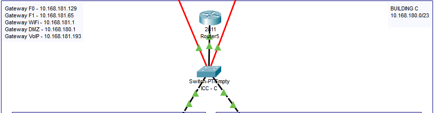
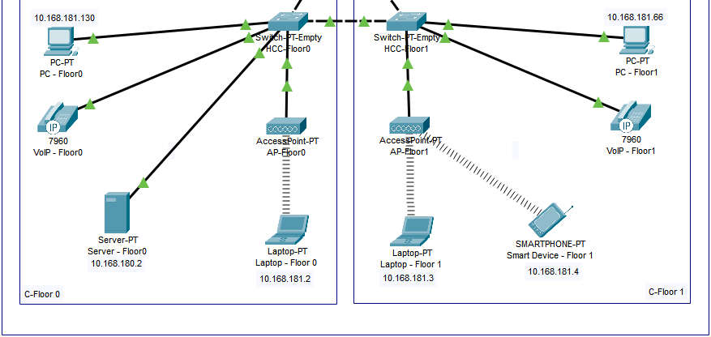
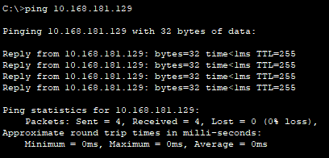
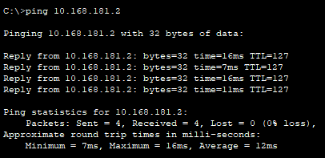
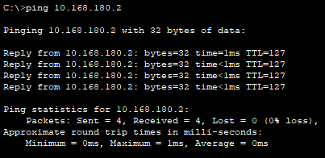
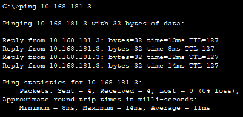
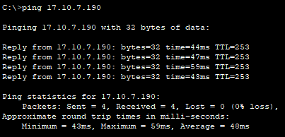
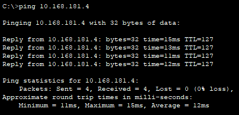

# ISEP-RCOMP-2020

##### EN (Computational Networks)
Resolution of RCOMP Sprints.

Each Sprint has a respective statement on 'Statements' folder.

RCOMP project is developed as a group, my part was the building C. Each Sprint is described below in detail.

--------------------------------

## Building C ##

### Sprint 1

--------------------------------

##### Rooms Area Measurements:

* Floor Zero:

	* Total Area : (80m * 30m) = 2400 m 2
	* Right Area : (60m * 30m) = 1600 m 2
	* Left Area : (20m * 30m) = 800 m 2
	* Room CO.1 : (7,5m * 6m) = 45 m 2
	* Room CO.2 : (7,5m * 6m) = 45 m 2
	* Room CO.3 : (7,5m * 6m) = 45 m 2
	* Room CO.4 : (8m * 5,5m) = 44 m 2
	* Room CO.5 : (6m * 5,5m) = 33 m 2

	* Floor Zero Common Area (Hall, WC’s, Stairs): 2400 m 2 – 1812 m 2 = 588 m 2

* Floor One:

	* Left Area : (20m * 30m) = 800 m 2
	* Room C1.1 : (6m * 7m) = 42 m 2
	* Room C1.2 : (6m * 7m) = 42 m 2
	* Room C1.3 : (6m * 11m) = 66 m 2
	* Room C1.4 : (5,5m * 15m) = 82,5 m 2
	* Room C1.5 : (5,5m * 13m) = 71,5 m 2

	* Floor One Common Area (Hall, WC’s, Stairs): 800 m 2 - 304 m 2 = 496 m 2

##### Resulting standard number of network outlets:

* Floor Zero:

	* Ground Floor Right Area : (2 + (1600 / 10)*2) = 322 outlets (ISO8877 / RJ45)
	* Room CO.1 : (2 + (45 / 10)*2) = 13 outlets (ISO8877 / RJ45)
	* Room CO.2 : (2 + (45 / 10)*2) = 13 outlets (ISO8877 / RJ45)
	* Room CO.3 : (2 + (45 / 10)*2) = 13 outlets (ISO8877 / RJ45)
	* Room CO.4 : (2 + (44 / 10)*2) = 11 outlets (ISO8877 / RJ45)
	* Room CO.5 : (2 + (33 / 10*2) = 9 outlets (ISO8877 / RJ45)

* Floor One:

	* Room C1.1 : (2 + (42 / 10)*2) = 10 outlets (ISO8877 / RJ45)
	* Room C1.2 : (2 + (42 / 10)*2) = 10 outlets (ISO8877 / RJ45)
	* Room C1.3 : (2 + (66 / 10)*2) = 15 outlets (ISO8877 / RJ45)
	* Room C1.4 : (2 + (82,5 / 10)*2) = 18 outlets (ISO8877 / RJ45)
	* Room C1.5 : (2 + (71,5 / 10*2) = 16 outlets (ISO8877 / RJ45)

-----------------------------------------------------------

##### Schematic Plans:

###### Floor Zero :

-----------------------------------------------------------

-----------------------------------------------------------

With the calculations seen above, the number of network outlets was respected according to the standard, being deployed two for each 10 m 2 , and adding 2 to the room in assessment.
The schematic plan of network outlets of the left work area depicted in the image above, shows
a care for placement in a manner that one user has always an available outlet in a 3 meter radius.
Regarding the right area, the outlets were directly attached to the suspended cable raceways in
order to provide a homogenous coverage of the entire open space, they were spread in each
vertical railway in sets of 7, totalling 28 for each railway, and sets of 4 in each vertical railway
interval. This way, they are not overly cluttered, and they provide some free space in the railway
for easier access and possibly technician manoeuvering.

Due to the massive surface covered with network outlets in the right area, 10 consolidation
points were added where each one handles the vertical cable raceway at his right and the 4
outlets on horizontal raceway, also at it’s right, in order to control the cable sizing. This way,
another rule of horizontal cabling is fulfilled, which is that in a straight line, no cable is ever
longer than 90 meters, and in a straight line, the distance of an HC to any outlet is not greater
than 80 meters.

Regarding wireless access points, since they provide a somewhat reliable service in a radius of
30 meters, 3 devices were deployed across the floor respecting this feature, allowing a full
coverage of the area, with the necessary overlaps, to compensate the possible disturbance of
the signal propagation due to walls or columns.

Backbone wise, to respect an important rule of structured cabling that states that a horizontal
cross-connect should never cover an area of 1000 m 2 or larger. Since the right work area alone
has 1600 m 2 , two HC’s were added to the room, each one controlling essentially half of it. In the
left area, one HC is enough. As seen in the image, the right HC (1) is the one handling the CP’s
and Access Point with the number 1 on them, the same applies to HC (2) and HC (3), following
the same logic. To facilitate access, and adding logic, the Intermediate cross-connect of this
building is located in the same room as the external ditch entry.

-------------------------------------------------------------

####### Floor Zero :

Since the right 1600 m2 area of the building is common to both floors, the following blueprint
only depicts the left area of the first floor, since the right area was shown above in the ground
floor blueprint.

-----------------------------------------------------------

Like the below floor, outlets were placement following the same logic, allowing any user to have
an outlet within roughly 3 meters. To facilitate cable management and possible upgrades,
consolidation points were added to this area aswell, one handling the C1.5 room because it is
distanced from the upper rooms, another one handling the C1.4 room, and finally one handling
C1.2 and C1.3 rooms.

To facilitate access, and adding logic, the Intermediate cross-connect of this building is located
in the same room as the floor cable passageway. A wireless access point was also added covering
the entire area.

All horizontal cabling rules were accomplished, with no cable being greater than 90 meters, the
area covered by the horizontal cross-connect is tasked with handling 800 m 2 , and in a straight
line, the distance from the HC/CP is far less than the recommended 80 meters.

-----------------------------------------------------------

##### Cabling:

The used cable is CAT6 as solicited in the Laboratory Class 01 Sprint guidelines. Types above are
significantly more expensive, and the CAT6 can handle perfectly the task at hands in this Sprint.
It follows the T568A wiring pattern across the entire blueprint.

-----------------------------------------------------------

##### Cabling Measures (Floor Zero):

**Room C0.1** longest cable has 12,5 meters (the one feeding the access point of the left area work
area) and the smallest one has 3 meters, which feeds the outlet nearest of the HC. Making an
average of 7,75 meters. Since there are 14 cable connections there + 1 for redundancy between
backbone cabling, this room needs **117** meters of cable.

**Room C0.2** longest cable has 16,5 meters (the one feeding the bottom left outlet of the room)
and the smallest has 5,5 meters, which feeds the top right outlet. Making an average of 11
meters. Since there are 14 cable connections aswell + 1 for redundancy between backbone
cabling, this room needs **165** meters of cable.

**Room C0.3** longest cable has 12,5 meters (the one feeding the bottom right outlet of the room)
and the smallest has 2,5 meters, which feeds the top left outlet. Making an average of 7,5
meters. Since there are 15 cable connections + 2 for redundancy between backbone cabling, this
room needs **128** meters of cable.

**Room C0.4** longest cable has 29 meters (the one feeding the bottom left outlet of the room) and
the smallest has 20 meters, which feeds the top right outlet. Making an average of 24,5 meters.
Since there are 11 cable connections, this room needs **270** meters of cable.

**Room C0.5** longest cable has 21 meters (the one feeding the bottom right outlet of the room)
and the smallest has 13 meters, which feeds the top left outlet. Making an average of 17 meters.
Since there are 9 cable connections, this room needs **153** meters of cable.

**Right Area** longest cable has 29 meters (the one connecting both horizontal cross-connects of
the area) and the reasonably smallest has 1,5 meters, which is any cable connecting a
consolidation point to the outlet on the right. Making an average of 15,5 meters. Since there are
332 cable connections, this area needs **5146** meters of cable.

The ground floor needs roughly **6000** meters of cable.

-----------------------------------------------------------

##### Cabling Measures (Floor One):

**Room C1.1** longest cable has 24 meters (the one feeding the access point of this floor) and the
smallest has 1,5 meters, which feeds the outlet nearest of the horizontal cross connect. Making
an average of 13 meters. Since there are 12 cable connections, this room needs **156** meters of
cable.

**Room C1.2** longest cable has 19 meters (the one feeding the bottom right outlet of the room)
and the smallest has 1,5 meters, which feeds the outlet right to the consolidation point. Making
an average of 11 meters. Since there are 10 cable connections + 2 for redundancy between
backbone cabling, this room needs **132** meters of cable.

**Room C1.3** longest cable has 29 meters (the one connecting the bottom right outlet to the
second room consolidation point), and the smallest has 11 meters, which feeds the top right
outlet of the room. Making an average of 20 meters. Since there are 13 connections + 2 for
redundancy between backbone cabling, this room needs **300** meters of cable.

**Room C1.4** longest cable has 24,5 meters (the one connecting both consolidation points), and
the smallest has 3 meters, which is the one connecting the adjacent consolidation point and
the nearest outlet to it. Making an average of 14 meters. Since there are 18 cable connections
+ 2 for redundancy between backbone cabling, this room needs **252** meters of cable.

**Room C1.5** longest cable has 19 meters of cable (the one feeding the bottom left outlet of the
room), and the smallest has 5 meters, which is the one feeding the top right outlet. Making an
average of 12 meters. Since there are 16 cable connections, this room needs **192** meters of
cable.

The upper floor needs roughly **1050** meters of cable.

-----------------------------------------------------------

##### Total:

* The total length of cable needed is roughly 7050, which we’ll round up to **7100** for safety.

-----------------------------------------------------------

##### Inventory:

* CAT6 Cable – 7100 meters
* RJ45 Outlets – 450 units
* 48 Set Patch Panels – 24 (oversize considered)
* 24 Set Patch Panels – 10 (oversize considered)
* Enclosures for CP’s - 15
* Enclosures for HC’s - 4
* Enclosures for IC’s – 1
* Access Point Hardware - 4

-----------------------------------------------------------

### Sprint 2

--------------------------------

### Building C Topology

This is a printscreen depicting the network topology at building C, the project itself can be found in my own folder under the name 'buildingC.pkt'.

-------------------------------------------------------------------

-------------------------------------------------------------------

## IP Subnetting

**IP Address assigned to building C :** 10.168.180.0/23

- End user outlets on the ground floor: 40 nodes
- End user outlets on floor one: 44 nodes
- Wi-Fi network: 60 nodes
- Local servers, administration workstations, and machines (DMZ): 250 nodes
- VoIP (IP-phones): 40 nodes

To allocate the 250 DMZ nodes, 10.168.180.0/23 was subnetted down to two /24 subnets.

- 10.168.180.0/24 to allocate 254 usable host addresses
- 10.168.181.0/24 to allocate remaining host addresses

To allocate the remaining nodes 10.168.181.0/24 was subnetted down to four /26 subnets.

- 10.168.181.0/26 (64 usable host addresses) to allocate the Wi-Fi 60 required hosts.
- 10.168.181.64/26 (64 usable host addresses) to allocate the First Floor 44 required hosts.
- 10.168.181.128/26 (64 usable host addresses) to allocate the Ground Floor 40 required hosts.
- 10.168.181.192/26 (64 usable host addresses) to allocate the VoIP 40 required hosts.

This subnetting also has room for future scaling within the VLANS.

-------------------------------------------------------------------

The following table will show the attribution of VLAN ID's following the ID's that were assigned to us in the assignment, aswell as the network IP's and their respective gateway.

-------------------------------------------------------------------

| VLAN Location|  VLAN ID   |     Network IP    | Default Gateway |
| ------------ | ---------- | ----------------- | --------------- |
|   Floor 0    |    658     | 10.168.181.128/26 | 10.168.181.129  |
|   Floor 1    |    659     | 10.168.181.64/26  | 10.168.181.65   |
|   Wi-Fi      |    660     | 10.168.181.0/26   | 10.168.181.1    |
|   DMZ	       |    661     | 10.168.180.0/24   | 10.168.180.1    |
|   VoIP       |    662     | 10.168.181.192/26 | 10.168.181.193  |

-------------------------------------------------------------------

## Configurations & Commands

- VLANS were added to the MCC VLAN Database (658 to 662), as MCC is the server and should replicate the database to all "child" layer 2 devices.
	- **MMC(config)#** vlan *vlanNumber*
	- **MMC(config-vlan)#** name *Name*
	- **MMC(config-vlan)#** exit
- ICC interfaces set to trunk mode.
	- **Switch(config)#** interface FastEthernet *interface*
	- **Switch(config-if)#** switchport mode trunk
	- **Switch(config-if)#** exit
- HCC interfaces set to access mode.
	- **Switch(config)#** interface FastEthernet *interface*
	- **Switch(config-if)#** switchport mode access
	- **Switch(config-if)#** exit
- End devices were connected to the HCCs using Copper ST cables.
- Redundancy between HCCs was taken into consideration.
- The HCC interfaces connected to those devices were assigned a specific VLAN:
	- **Switch(config)#** interface FastEthernet *interface*
	- **Switch(config-if)#** switchport access vlan *vlanNumber*
	- **Switch(config-if)#** exit
- Static routes configured on Router.
	- **Router(config)#** ip route *DestinationIP* *SubnetMask* *NextHop*
- Sub-interfaces were assigned to Router5 to match VLANs IDs. These VLAN IDs range from 658 to 662 at my building and they can be matched to a specific area as it can be seen in the table above
	- **Router(config)#** interface FastEthernet0/0.*vlanID*
	- **Router(config-subif)#** encapsulation dot1Q *vlanID*
	- **Router(config-subif)#** ip address *IpAddress(VLAN defaultGateway)* *SubnetMask*
	- **Router(config-subif)#** no shutdown
	- **Router(config-subif)#** exit
- SSIDS configured on Acess Points.
- IP Addresses assigned to all end devices
- Laptops connected to respective Acess Points.

-------------------------------------------------------------------

## ICMP Connectivity Tests (Pings)

The following images show the successfull connectivity tests done between devices where a ping command was made from the Floor 0 to every other device on the network, showing this way that every device is reachable.

-------------------------------------------------------------------

1 - Floor 0 PC to DMZ Gateway

2 - Floor 0 PC to Floor 0 Gateway

3 - Floor 0 PC to Floor 0 Laptop

4 - Floor 0 PC to Floor 0 Server

5 - Floor 0 PC to Floor 1 Gateway

6 - Floor 0 PC to Floor 1 Laptop

7 - Floor 0 PC to DMZ Gateway

8 - Floor 0 PC to ISP Gateway

9 - Floor 0 PC to VoIP Gateway

10 - Floor 0 PC to Wi-Fi Gateway

11 - Floor 0 PC to Floor 1 Smart Device

-------------------------------------------------------------------

### Sprint 3

-------------------------------------------------------------------

### Building C Topology

This is a printscreen depicting the network topology at building C, the project itself can be found in my own folder under the name 'buildingC.pkt', now with the addition of the HTTP Server.

-------------------------------------------------------------------

-------------------------------------------------------------------

## Configurations & Commands

#### OSPF (Open Shortest Path First)

- Static routes were deleted from the routing table, and the OSPF was established at Building C router as shown below, it was also established in all routers. Wildcard is 0.0.1.255, which is the oppposite of 255.255.254.0.
	- **BC-Router(config)#** router ospf 3
	- **BC-Router(config-router)#** network 10.168.184.1 0.0.1.255 area 0
	- **BC-Router(config-router)#** network 10.168.176.1 0.0.1.255 area 1
	- **BC-Router(config-router)#** network 10.168.178.1 0.0.1.255 area 2
	- **BC-Router(config-router)#** network 10.168.180.1 0.0.1.255 area 3
	- **BC-Router(config-router)#** network 10.168.182.1 0.0.1.255 area 4

-------------------------------------------------------------------

#### HTTP Server

- A new server was added to floor 0 to serve as an HTTP server for the network. It was added to the DMZ network and the HCC interface was altered to adjust to this new addition. The HTML was created to have the following aspect:

The HTML has a couple additions to make it more pleasing.

-------------------------------------------------------------------

#### DHCPv4 Service

- DHCP service was added to all local networks, replacing the previous static defined ones.
* Floor 0:
	- **BC-Router(config)#** ip dhcp pool F0
	- **BC-Router(dhcp-config)#** network 10.168.181.128 255.255.255.192
	- **BC-Router(dhcp-config)#** default-router 10.168.181.129
	- **BC-Router(dhcp-config)#** domain-name building-C.rcomp-19-20-dl-g1
	- **BC-Router(dhcp-config)#** dns-server 10.168.180.2
* Floor 1:
	- **BC-Router(config)#** ip dhcp pool F1
	- **BC-Router(dhcp-config)#** network 10.168.181.64 255.255.255.192
	- **BC-Router(dhcp-config)#** default-router 10.168.181.65
	- **BC-Router(dhcp-config)#** domain-name building-C.rcomp-19-20-dl-g1
	- **BC-Router(dhcp-config)#** dns-server 10.168.180.2
* WiFi:
	- **BC-Router(config)#** ip dhcp pool WiFi
	- **BC-Router(dhcp-config)#** network 10.168.181.0 255.255.255.192
	- **BC-Router(dhcp-config)#** default-router 10.168.181.1
	- **BC-Router(dhcp-config)#** domain-name building-C.rcomp-19-20-dl-g1
	- **BC-Router(dhcp-config)#** dns-server 10.168.180.2
* VoIP:
	- **BC-Router(config)#** ip dhcp pool VoIP
	- **BC-Router(dhcp-config)#** network 10.168.181.192 255.255.255.192
	- **BC-Router(dhcp-config)#** default-router 10.168.181.193
	- **BC-Router(dhcp-config)#** domain-name building-C.rcomp-19-20-dl-g1
	- **BC-Router(dhcp-config)#** dns-server 10.168.180.2
	- **BC-Router(dhcp-config)#** option 150 ip 10.168.181.193

-------------------------------------------------------------------

* It was also guaranteed that the various gateway adresses were excluded from the entire pool as show below:
	- **BC-Router(config)#** ip dhcp excluded-address 10.168.180.1
	- **BC-Router(config)#** ip dhcp excluded-address 10.168.181.1
	- **BC-Router(config)#** ip dhcp excluded-address 10.168.180.65
	- **BC-Router(config)#** ip dhcp excluded-address 10.168.180.129
	- **BC-Router(config)#** ip dhcp excluded-address 10.168.180.193

-------------------------------------------------------------------

#### VoIP Service

- The VoIP phones were added to the network, and they now can communicate with each other, all the commands used are shown below:
	- **BC-Router(config)#** telephony-service
	- **BC-Router(config-telephony)#** no auto-reg-ephone
	- **BC-Router(config-telephony)#** ip source-address 10.168.181.193 port 2000
	- **BC-Router(config-telephony)#** max-ephones 20
	- **BC-Router(config-telephony)#** max-dn 20
	- **BC-Router(config-telephony)#** exit
	- **BC-Router(config)#** ephone-dn 1
	- **BC-Router(config-ephone-dn)#** number 4001
	- **BC-Router(config-ephone-dn)#** exit
	- **BC-Router(config)#** ephone-dn 2
	- **BC-Router(config-ephone-dn)#** number 4002
	- **BC-Router(config-ephone-dn)#** exit
	- **BC-Router(config)#** ephone 1
	- **BC-Router(config-ephone)#** mac-address 0001.43B0.B2D6
	- **BC-Router(config-ephone)#** button 1:1
	- **BC-Router(config-ephone)#** exit
	- **BC-Router(config)#** ephone 2
	- **BC-Router(config-ephone)#** mac-address 0090.2B6D.602E
	- **BC-Router(config-ephone)#** button 1:2
	- **BC-Router(config-ephone)#** exit
	- **BC-Router(config)#** dial-peer voice 1 voip
	- **BC-Router(config-dial-peer)#** destination-pattern 2...
	- **BC-Router(config-dial-peer)#** session target ipv4:10.168.177.33
	- **BC-Router(config-dial-peer)#** exit
	- **BC-Router(config)#** dial-peer voice 2 voip
	- **BC-Router(config-dial-peer)#** destination-pattern 3...
	- **BC-Router(config-dial-peer)#** session target ipv4:10.168.179.65
	- **BC-Router(config-dial-peer)#** exit
	- **BC-Router(config)#** dial-peer voice 3 voip
	- **BC-Router(config-dial-peer)#** destination-pattern 5...
	- **BC-Router(config-dial-peer)#** session target ipv4:10.168.183.193
	- **BC-Router(config-dial-peer)#** end

-------------------------------------------------------------------

- The image below shows the left phone calling the right phone. As indicated by the **red arrow**, the left phone is making a call to *4002*. The right phone is receiving this call from *4001*, as indicated by the **blue arrow**.

-------------------------------------------------------------------

#### DNS

- The DNS table is shown below with all buildings included.

-------------------------------------------------------------------

#### NAT

- Static NAT was used to redirect traffic, and the commands below were used for this purpose:
	- **BC-Router(config)#** ip nat inside source static tcp 10.168.180.2 80 10.168.184.3 80
	- **BC-Router(config)#** ip nat inside source static tcp 10.168.180.2 80 10.168.184.3 80
	- **BC-Router(config)#** ip nat inside source static tcp 10.168.180.2 53 10.168.184.3 53
	- **BC-Router(config)#** ip nat inside source static udp 10.168.180.2 53 10.168.184.3 53

-------------------------------------------------------------------

#### ICMP Tests

The following images show the successfull connectivity tests done between devices where a ping command was made from the Floor 0 to every other device on the network, showing this way that every device is reachable.

-------------------------------------------------------------------
