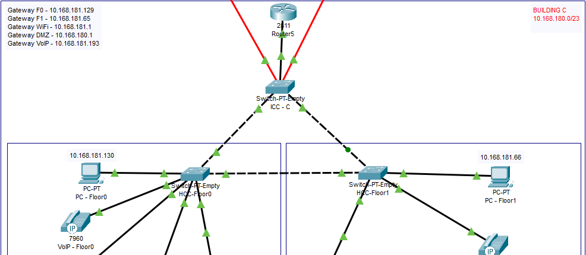
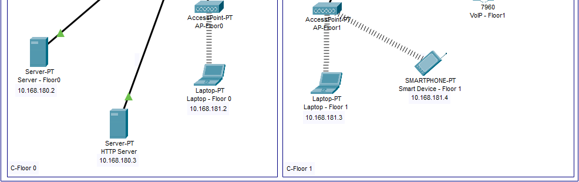
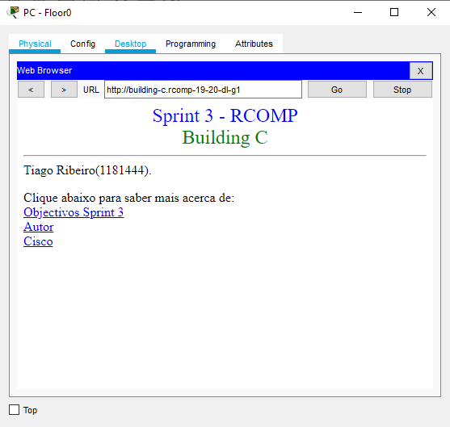
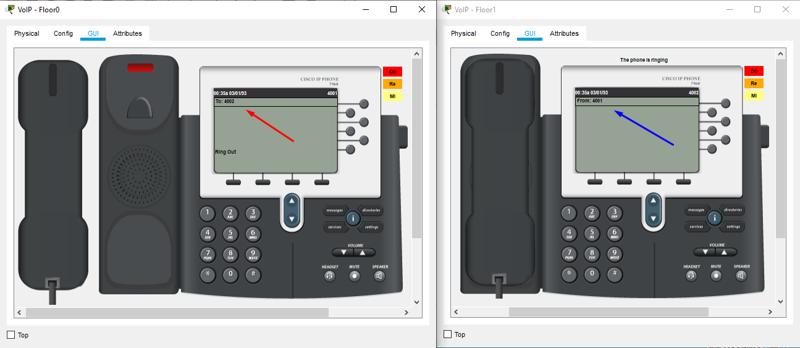
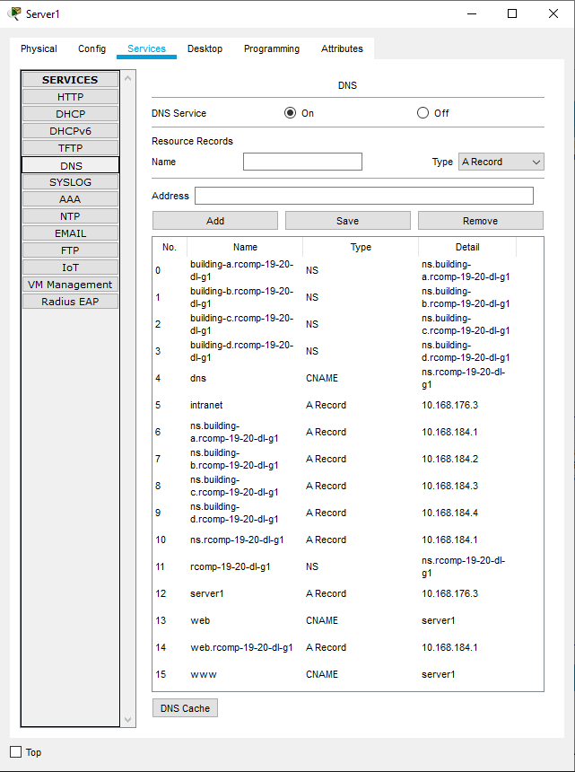
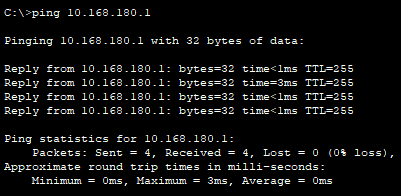
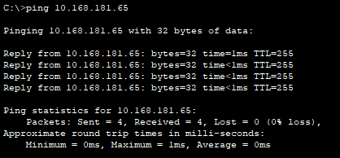
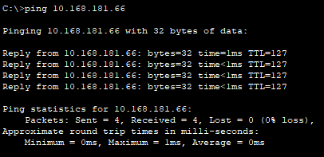
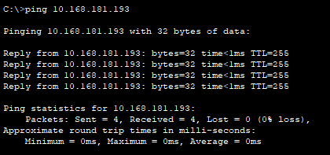
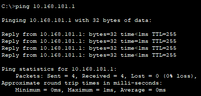

RCOMP 2019-2020 Project - Sprint 3 - Member 1181444 folder
===========================================
### Tiago Soares Ribeiro

-------------------------------------------------------------------

### Building C Topology

This is a printscreen depicting the network topology at building C, the project itself can be found in my own folder under the name 'buildingC.pkt', now with the addition of the HTTP Server.

-------------------------------------------------------------------

-------------------------------------------------------------------

### IP Subnetting

IP Subnetting decisions can be consulted in the previous sprint README.md file.

-------------------------------------------------------------------

The following table will show the attribution of VLAN ID's following the ID's that were assigned to us in the assignment, aswell as the network IP's and their respective gateway.

-------------------------------------------------------------------

| VLAN Location|  VLAN ID   |     Network IP    | Default Gateway |
| ------------ | ---------- | ----------------- | --------------- |
|   Floor 0    |    658     | 10.168.181.128/26 | 10.168.181.129  |
|   Floor 1    |    659     | 10.168.181.64/26  | 10.168.181.65   |
|   Wi-Fi      |    660     | 10.168.181.0/26   | 10.168.181.1    |
|   DMZ	       |    661     | 10.168.180.0/24   | 10.168.180.1    |
|   VoIP       |    662     | 10.168.181.192/26 | 10.168.181.193  |

-------------------------------------------------------------------

## Configurations & Commands

#### OSPF (Open Shortest Path First)

- Static routes were deleted from the routing table, and the OSPF was established at Building C router as shown below, it was also established in all routers. Wildcard is 0.0.1.255, which is the oppposite of 255.255.254.0.
	- **BC-Router(config)#** router ospf 3
	- **BC-Router(config-router)#** network 10.168.184.1 0.0.1.255 area 0
	- **BC-Router(config-router)#** network 10.168.176.1 0.0.1.255 area 1
	- **BC-Router(config-router)#** network 10.168.178.1 0.0.1.255 area 2
	- **BC-Router(config-router)#** network 10.168.180.1 0.0.1.255 area 3
	- **BC-Router(config-router)#** network 10.168.182.1 0.0.1.255 area 4

-------------------------------------------------------------------

#### HTTP Server

- A new server was added to floor 0 to serve as an HTTP server for the network. It was added to the DMZ network and the HCC interface was altered to adjust to this new addition. The HTML was created to have the following aspect:

The HTML has a couple additions to make it more pleasing.

-------------------------------------------------------------------

#### DHCPv4 Service

- DHCP service was added to all local networks, replacing the previous static defined ones.
* Floor 0:
	- **BC-Router(config)#** ip dhcp pool F0
	- **BC-Router(dhcp-config)#** network 10.168.181.128 255.255.255.192
	- **BC-Router(dhcp-config)#** default-router 10.168.181.129
	- **BC-Router(dhcp-config)#** domain-name building-C.rcomp-19-20-dl-g1
	- **BC-Router(dhcp-config)#** dns-server 10.168.180.2
* Floor 1:
	- **BC-Router(config)#** ip dhcp pool F1
	- **BC-Router(dhcp-config)#** network 10.168.181.64 255.255.255.192
	- **BC-Router(dhcp-config)#** default-router 10.168.181.65
	- **BC-Router(dhcp-config)#** domain-name building-C.rcomp-19-20-dl-g1
	- **BC-Router(dhcp-config)#** dns-server 10.168.180.2
* WiFi:
	- **BC-Router(config)#** ip dhcp pool WiFi
	- **BC-Router(dhcp-config)#** network 10.168.181.0 255.255.255.192
	- **BC-Router(dhcp-config)#** default-router 10.168.181.1
	- **BC-Router(dhcp-config)#** domain-name building-C.rcomp-19-20-dl-g1
	- **BC-Router(dhcp-config)#** dns-server 10.168.180.2
* VoIP:
	- **BC-Router(config)#** ip dhcp pool VoIP
	- **BC-Router(dhcp-config)#** network 10.168.181.192 255.255.255.192
	- **BC-Router(dhcp-config)#** default-router 10.168.181.193
	- **BC-Router(dhcp-config)#** domain-name building-C.rcomp-19-20-dl-g1
	- **BC-Router(dhcp-config)#** dns-server 10.168.180.2
	- **BC-Router(dhcp-config)#** option 150 ip 10.168.181.193

-------------------------------------------------------------------

* It was also guaranteed that the various gateway adresses were excluded from the entire pool as show below:
	- **BC-Router(config)#** ip dhcp excluded-address 10.168.180.1
	- **BC-Router(config)#** ip dhcp excluded-address 10.168.181.1
	- **BC-Router(config)#** ip dhcp excluded-address 10.168.180.65
	- **BC-Router(config)#** ip dhcp excluded-address 10.168.180.129
	- **BC-Router(config)#** ip dhcp excluded-address 10.168.180.193

-------------------------------------------------------------------

#### VoIP Service

- The VoIP phones were added to the network, and they now can communicate with each other, all the commands used are shown below:
	- **BC-Router(config)#** telephony-service
	- **BC-Router(config-telephony)#** no auto-reg-ephone
	- **BC-Router(config-telephony)#** ip source-address 10.168.181.193 port 2000
	- **BC-Router(config-telephony)#** max-ephones 20
	- **BC-Router(config-telephony)#** max-dn 20
	- **BC-Router(config-telephony)#** exit
	- **BC-Router(config)#** ephone-dn 1
	- **BC-Router(config-ephone-dn)#** number 4001
	- **BC-Router(config-ephone-dn)#** exit
	- **BC-Router(config)#** ephone-dn 2
	- **BC-Router(config-ephone-dn)#** number 4002
	- **BC-Router(config-ephone-dn)#** exit
	- **BC-Router(config)#** ephone 1
	- **BC-Router(config-ephone)#** mac-address 0001.43B0.B2D6
	- **BC-Router(config-ephone)#** button 1:1
	- **BC-Router(config-ephone)#** exit
	- **BC-Router(config)#** ephone 2
	- **BC-Router(config-ephone)#** mac-address 0090.2B6D.602E
	- **BC-Router(config-ephone)#** button 1:2
	- **BC-Router(config-ephone)#** exit
	- **BC-Router(config)#** dial-peer voice 1 voip
	- **BC-Router(config-dial-peer)#** destination-pattern 2...
	- **BC-Router(config-dial-peer)#** session target ipv4:10.168.177.33
	- **BC-Router(config-dial-peer)#** exit
	- **BC-Router(config)#** dial-peer voice 2 voip
	- **BC-Router(config-dial-peer)#** destination-pattern 3...
	- **BC-Router(config-dial-peer)#** session target ipv4:10.168.179.65
	- **BC-Router(config-dial-peer)#** exit
	- **BC-Router(config)#** dial-peer voice 3 voip
	- **BC-Router(config-dial-peer)#** destination-pattern 5...
	- **BC-Router(config-dial-peer)#** session target ipv4:10.168.183.193
	- **BC-Router(config-dial-peer)#** end

-------------------------------------------------------------------

- The image below shows the left phone calling the right phone. As indicated by the **red arrow**, the left phone is making a call to *4002*. The right phone is receiving this call from *4001*, as indicated by the **blue arrow**.

-------------------------------------------------------------------

#### DNS

- The DNS table is shown below with all buildings included.

-------------------------------------------------------------------

#### NAT

- Static NAT was used to redirect traffic, and the commands below were used for this purpose:
	- **BC-Router(config)#** ip nat inside source static tcp 10.168.180.2 80 10.168.184.3 80
	- **BC-Router(config)#** ip nat inside source static tcp 10.168.180.2 80 10.168.184.3 80
	- **BC-Router(config)#** ip nat inside source static tcp 10.168.180.2 53 10.168.184.3 53
	- **BC-Router(config)#** ip nat inside source static udp 10.168.180.2 53 10.168.184.3 53

-------------------------------------------------------------------

#### ICMP Tests

The following images show the successfull connectivity tests done between devices where a ping command was made from the Floor 0 to every other device on the network, showing this way that every device is reachable.

-------------------------------------------------------------------

1 - Floor 0 PC to DMZ Gateway

2 - Floor 0 PC to Floor 0 Gateway

3 - Floor 0 PC to Floor 0 Laptop

4 - Floor 0 PC to Floor 0 Server

5 - Floor 0 PC to Floor 1 Gateway

6 - Floor 0 PC to Floor 1 Laptop

7 - Floor 0 PC to DMZ Gateway

8 - Floor 0 PC to ISP Gateway

9 - Floor 0 PC to VoIP Gateway

10 - Floor 0 PC to Wi-Fi Gateway

11 - Floor 0 PC to Floor 1 Smart Device

